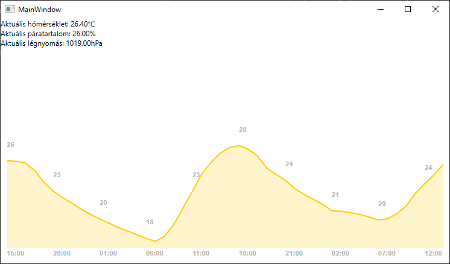

# Weather WPF App
Egy PoC alkalmazás openweathermap-ra
- MVVM 
- nincs külső library használva
- saját grafikon rajzoló
- példa ```ItemsControl```-ban többszörös ```DataTemplate``` használatára ```CompositeCollection```-nel és saját ```StyleSelector```-ral

Egy kép az alkalmazásról:  


# Development
Az ```App.sample.config```-fájlt át kell nevezni ```App.config```-ra és meg kell adni az ```apikey```-ben az openweathermap [api key](https://openweathermap.org/appid)-t